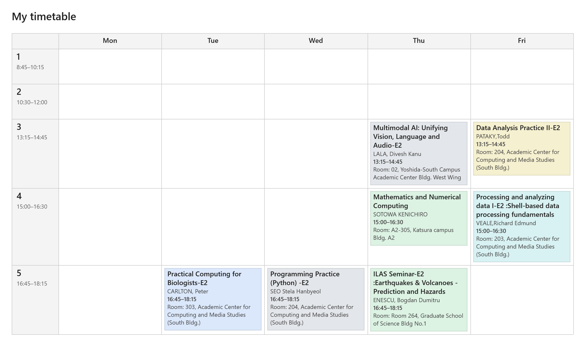
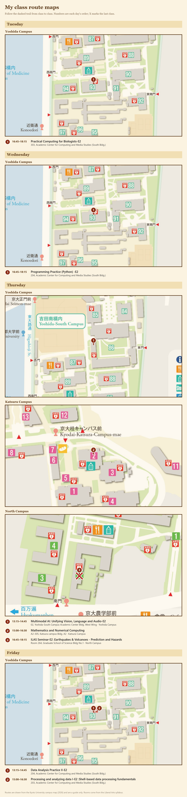
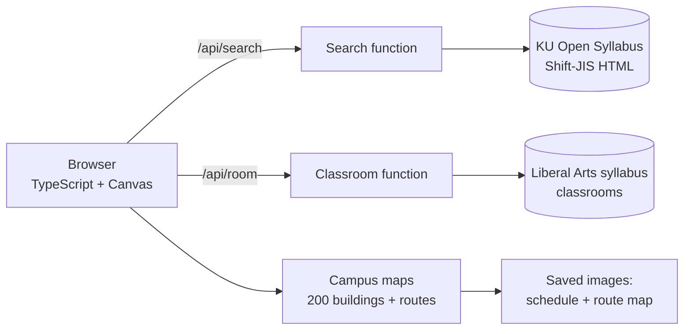

# KU Timetable Builder

**A timetable builder for Kyoto University students. Search the official syllabus, plan your weekly schedule, and save maps of the walk between your classes.**

*Click the preview to open the live site.*

---

##  What it does

The Kyoto University syllabus site lets students look up courses, but it has no tool for planning a weekly schedule and does not list classrooms. KU Timetable Builder searches the syllabus, places the courses you pick on a weekly timetable, and marks any time conflicts. You can save the timetable as an image, along with a map for each day that shows where your classes are and the route between them.

##  Features

- **Course search**: search the syllabus by keyword, instructor, faculty, term, language, or day and period.
- **Weekly timetable**: shows each class's start and end time and marks time conflicts. First- and second-semester courses in the same slot are not counted as conflicts. Your timetable is saved in the browser.
- **Mobile layout**: on a phone, the search options scroll on the left and the full timetable stays on screen on the right.
- **Classroom lookup**: finds the room for Liberal Arts courses from a second university system, since the public syllabus does not include rooms.
- **Save schedule**: saves an image of your week with course titles, instructors, times and rooms.
- **Save map**: saves a map for each day, covering every campus you have classes on. Classes are numbered in order, connected by dashed walking routes along campus paths, and the last class of the day is marked with an X.

## Screenshots

<table>
  <tr>
    <td></td>
    <td></td>
  </tr>
  <tr>
    <td align="center"><em>Timetable</em></td>
    <td align="center"><em>Class route map</em></td>
  </tr>
</table>

##  Built with

- **Frontend:** TypeScript and Vite, no framework. HTML Canvas draws the saved images, and the Web Share API saves them to a phone.
- **Backend / hosting:** Cloudflare Pages. Two Pages Functions handle syllabus search and classroom lookup, and their responses are cached at the edge.
- **Data:** the Kyoto University Open Syllabus for courses, the Liberal Arts syllabus for classrooms, and the 2026 campus maps for all 5 campuses. Timetables are stored only in the user's browser.
- **Testing:** 34 unit tests in Vitest, run against saved copies of syllabus pages.

## How it works

### Syllabus search

The syllabus site has no API. Its pages are HTML in Shift-JIS encoding, and it does not accept requests from other websites. A serverless function forwards only an allowlist of search fields, parses the results into JSON, and caches each search for 24 hours to limit load on the university's servers.

### Classroom lookup

The public syllabus has no room field. The Liberal Arts syllabus lists rooms and uses the same lecture numbers, but it cannot be searched by lecture number. The app searches it by the instructor's surname, then by course title, and selects the lecture with the matching number. Names and titles are normalized before searching.

### Route maps

The 5 campus maps have 200 buildings marked on them. A matcher maps room names to buildings, including English names and Japanese abbreviations such as `共北21` and `4共10`. It places 97% of the 3,114 Liberal Arts lectures in the current syllabus.

To draw walking routes, the app scales each map down to a grid and classifies every cell by colour as path, lawn, building or water. It then runs A* pathfinding between buildings and simplifies the result. If no route is found, it draws a straight line. The saved image is drawn at a lower resolution when it gets tall, so it stays within the canvas size limit on iPhones.
